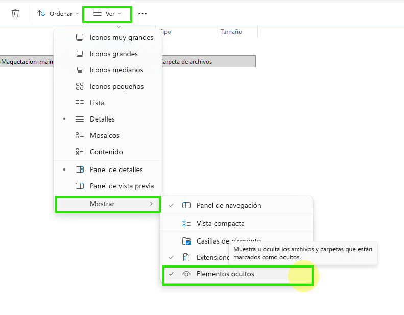
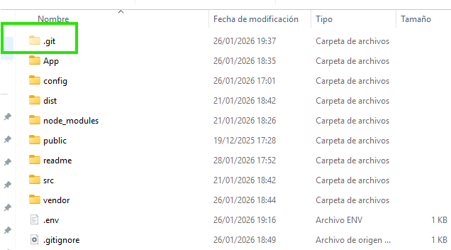

# REGLAS DE INSTALACIÓN DE ESTE PROYECTO

## 1. Descargar el proyecto de GitHub

Descargar el proyecto de GitHub. Clonamos el proyecto en nuestro VSC.

## 2. Borrar la carpeta .git 

Borrar la carpeta .git de existir. Recuerda configurar tu exploirador de archivos para que permita nver elementos ocultos

-  mostrar archivos ocultos



-  borrar carpeta .git



## 3. Instalar las dependencias de composer y npm.

- Instalación dedependencias de PHP

```bash
composer update
```

- Instalación dedependencias de Javascript (node modules)

```bash
npm install
``` 

## 4. Creación del archivo enviroment (.env)

Creamos el archivo .env y usamos estas claves de variable. 

```bash
# CREDENCIALES DE PHP MAILER (envioPhpMailer.php)
USERNAME= {usuario del correo, que suele ser el email}
PASS={contraseña del correo}
HOST={servidor de correo saliente}

# CONFIGURACIÓN DE CORREOS DE ESTE PROYECTO (gestionForm.php)
EMAIL_WEB={email de que se envia}
EMAIL_ADMIN={correo destinastario del admin de la web}

```

## 5. Arrancar servidor y dev

    - Para poder usar este proyecto en dev mode, debes levantar un server local en el puerto 8000 (tiene proxy al 3000).

    ```bash
    php -S localhost:8000
    ```


    - En otra terminal ejecutas el npm run dev

    ```bash
    npm run dev
    ```

De esta manera ya tendríamos en el navegador en el localhost:3000 la página en modo dev.

6. Subir a producción

Una vez desarrolada la web, se ejecutará en consola el comando build

```bash
npm run build
```

YTa sólo quedará subir a producción los ficheros y carpetas correspondientes.

los de la imagen y el .env

recordad cambiar el valor para producción de la variable de dev a pro antes de subir dicho archivo a la raiz, junto al index.php

```bash
APP_ENV=dev
# APP_ENV=pro
```

Ficheros que hay que subir. Nota: junto al index, subir el .env con la variable cambiada


Enjoy

